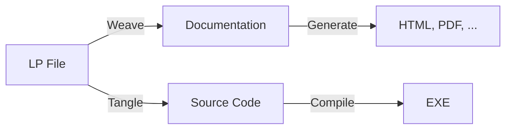
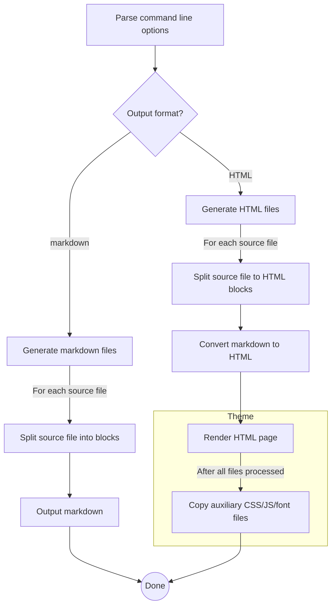

# Literate Programming and the Art of Documenting C# Code

> Let us change our traditional attitude to the construction of programs: Instead of imagining that 
> our main task is to instruct a computer what to do, let us concentrate rather on explaining to human 
> beings what we want a computer to do.
>
> _Donald Knuth, Computer Journal, 1984_

[Literate programming](https://en.wikipedia.org/wiki/Literate_programming) is a software design 
methodology proposed by [Donald Knuth](https://en.wikipedia.org/wiki/Donald_Knuth), one of the 
great men in computer science. Its guiding principle is that computer programs should be 
written like a book or an essay. Knuth argues that programmers should not focus just on writing 
code, they should also document the thought processes that led them to the chosen implementation; 
not only describing _what_ the code does, but _why_. This clearly helps other programmers 
understand the code better, but also the author will find it easier to revise the code 
later on.

Back in the 80s when Knuth first introduced his idea, he wrote a set of tools to manage code
and documentation together. These tools take a file containing text and code interleaved and 
produce the source code to be compiled, as well as the "documentation source" that can be converted 
to a readable format. They are basically preprocessors which operate on the same source file, 
extracting different parts from it. Knuth called this source language `WEB`, hence the tools 
were called _Weave_ and _Tangle_. Weave produces the documentation in 
[_TeX_](https://en.wikipedia.org/wiki/TeX) format and Tangle produces compilable code. The 
concept is depicted in the picture below.

A more common way to combine code and documentation is to write the documentation inside comments and 
extract it using a post-processor, leaving the compilation process unchanged. For example, Haskell, 
Python, and Lisp have literate programming tools available that work like this. However, there hasn't 
been any notable attempts to make literate programming possible in .NET. One of the reasons why literate 
programming is unfamiliar to most programmers is because the tooling has not been available for 
the mainstream development platforms.

Another reason for literate programming's lack of popularity is that it requires the programmer
to be proficient in two traits instead of just one. Writing fluent prose can be as hard as writing 
good code - and equally time consuming as well. Nevertheless, the benefits of having both working 
software and comprehensive documentation can sometimes outweigh the costs. Especially, when writing 
software whose inner workings need to be understood by others; such as libraries, tutorials, 
example programs, and so on. Additional benefit is that the documentation can be produced in various 
shapes and forms: as a PDF, blog post, presentation, website, or even as a complete book. In fact, 
there are quite popular recently published books that have been written as literate programs; for 
example the [Physically Based Rendering](http://www.pbrt.org/) book.

In .NET languages the standard way of documenting code is to write XML comments. API documentation
generated from XML comments serves as a reference manual that can be used to quickly find what a 
specific class or method does. When done properly, it can be a satisfactory way of describing the 
correct use of an API. However, writing XML comments is a tedious task, and requires a 
lot of discipline. XML comments tend to be verbose and repetitive which means that the produced 
documentation is dense and boring to read. In many cases, reading the code is faster than browsing 
through the documentation. There is little additional information in the XML comments, usually.

## `csweave` - Literate Programming Tool for C#

To make literate programming a viable option also for the C# developers, I wrote a tool 
called `csweave`. The documentation you are reading right now is generated from its source 
code. `csweave` parses C# source files and extracts text from comment blocks written in 
[markdown language](https://en.wikipedia.org/wiki/markdown). The idea is that you will 
interleave the documentation in the comments of your code and compile your code normally. 
You can then generate readable documentation from your code by running the tool. 

You don't need to use special syntax to annotate the documentation. All comments that are
_not_ in the XML comment format will be extracted and included in the output. This applies
only to multi-line comment blocks. Single line comments starting with `//` are shown as
code in the documentation. 

Literate comments can appear anywhere in your code. The goal is to write your code in small
pieces as you are describing what it does (and _why_) in the comments. This way the generated 
documentation becomes more readable and easy to follow.

We will go through the whole implementation of `csweave`, using it as an example on how to 
write programs in literate style. In the end we have covered all the features and options
available in the program. Not just how they work, but also how they are implemented. Let's
begin with the high-level view.

## The Structure of the Program

The high-level flow chart of the program is shown below. You can click a box in the diagram
to jump to the documentation of the corresponding module. Alternatively, you can jump to a page
by clicking a section in the table of contents. You can also move to the next and previous page 
using the navigation buttons on the top and the bottom.

